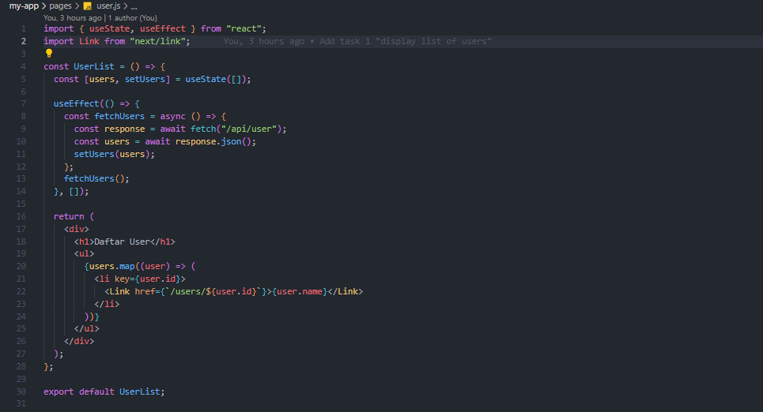
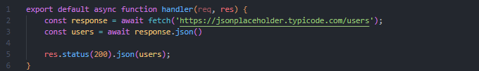
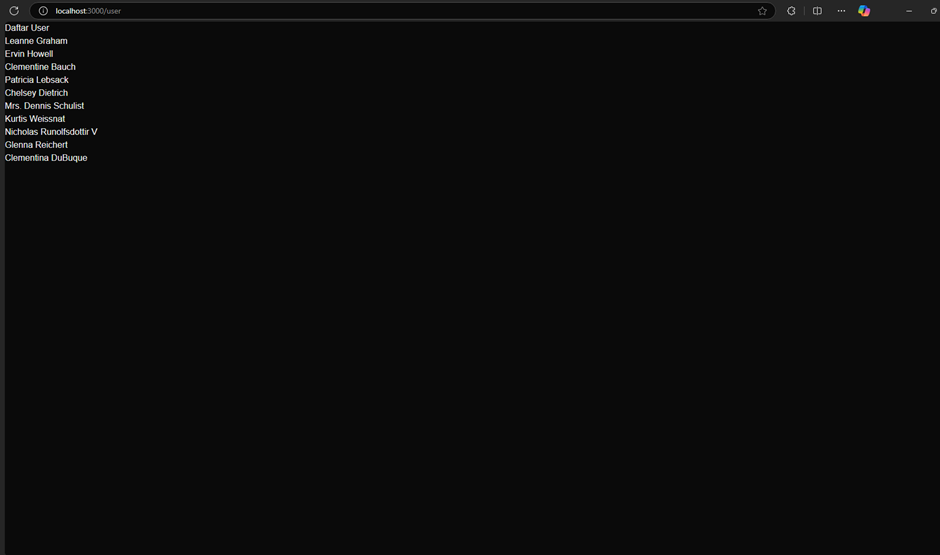
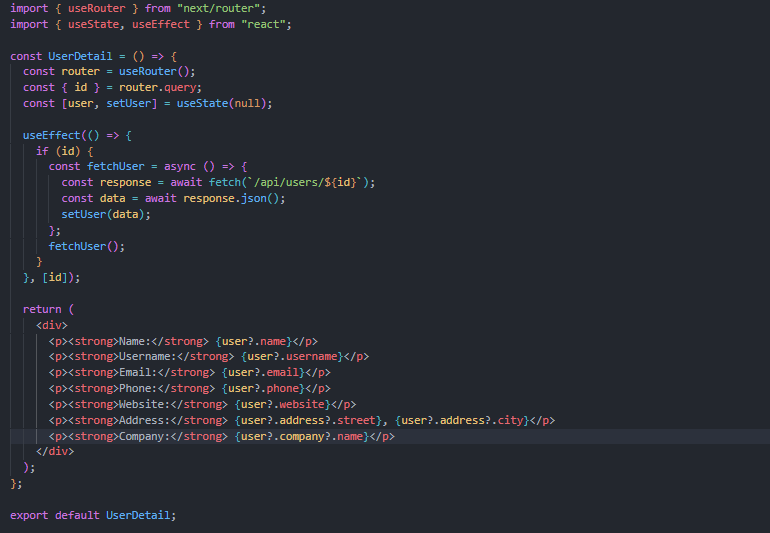
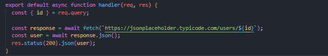
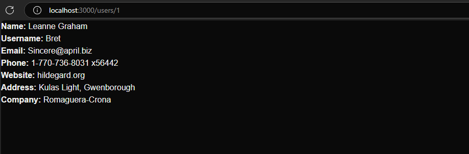
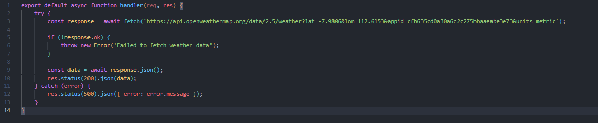
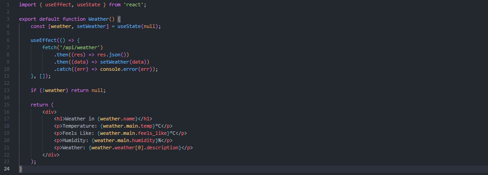
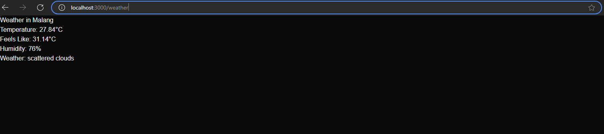

## Pertemuan 3  
### Pengenalan Next.js

### Tugas 
#### 1. Buat halaman baru dengan menggunakan Static Site Generation (SSG) yang menampilkan daftar pengguna dari API https://jsonplaceholder.typicode.com/users.
- API :   
- Halaman daftar pengguna:   
- Hasil :   
#### 2. Implementasikan Dynamic Routes untuk menampilkan detail pengguna berdasarkan ID. 
- Detail User Page:   
- Detail User API:   
- Hasil :   
#### 3. Buat API route yang mengembalikan data cuaca dari API eksternal (misalnya, OpenWeatherMap) dan tampilkan data tersebut di halaman front-end.
- Weather API:   
- Weather Page:   
- Hasil:  